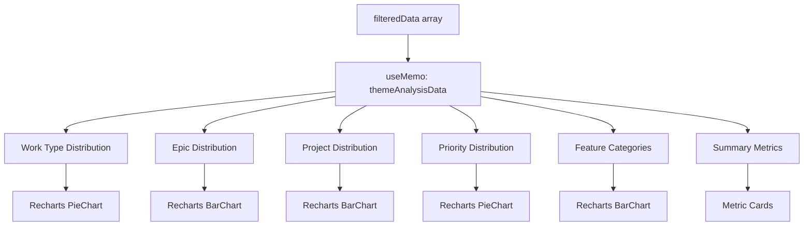

# Design Document: Sprint Theme Analysis Dashboard

## Overview

The Sprint Theme Analysis Dashboard is a new tab in the existing SprintDashboard.jsx component that provides visual insights into sprint composition and strategic focus. It analyzes the distribution of work types, epics, projects, priorities, and feature categories to help teams understand the "theme" of their sprint work.

This feature integrates seamlessly into the existing React dashboard architecture, using the same data source (filteredData), styling patterns (Tailwind CSS), visualization library (Recharts), and icon library (lucide-react) as other dashboard tabs.

### Key Design Principles

1. **Minimal Integration Footprint**: Add new functionality without modifying existing tab logic
2. **Consistent User Experience**: Match existing dashboard patterns for navigation, layout, and styling
3. **Performance Optimization**: Use React.useMemo for all computed data to prevent unnecessary recalculations
4. **Graceful Degradation**: Handle empty data states and edge cases without breaking the UI
5. **Responsive Design**: Ensure visualizations work across different screen sizes

## Architecture

### Component Hierarchy

```
SprintDashboard (existing)
├── Tab Navigation (modified to add themeAnalysis)
├── FilterPanel (existing, reused)
└── ThemeAnalysisSection (new)
    ├── Summary Metrics Cards (new)
    ├── Work Type Distribution Chart (new)
    ├── Epic Distribution Chart (new)
    ├── Project Focus Chart (new)
    ├── Priority Mix Chart (new)
    └── Feature Categories Chart (new)
```

### Data Flow



### Integration Points

1. **Tab Registration**: Add 'themeAnalysis' entry to the tabs object
2. **Tab Rendering**: Add conditional render block for activeTab === 'themeAnalysis'
3. **Data Source**: Use existing filteredData computed value (already filtered by sprint/assignee/project)
4. **Filter Integration**: Automatically respects FilterPanel selections through filteredData dependency

## Components and Interfaces

### 1. ThemeAnalysisSection Component

**Purpose**: Main container component that renders all theme analysis visualizations

**Props Interface**:
```javascript
{
  filteredData: Array<Object>,  // Array of Jira issues after filters applied
  selectedSprint: string,        // Current sprint filter (for display only)
  selectedAssignee: string,      // Current assignee filter (for display only)
  selectedProject: string        // Current project filter (for display only)
}
```

**Responsibilities**:
- Compute all visualization data using useMemo
- Render summary metrics cards
- Render all chart components
- Handle empty data state

### 2. Computed Data Structure (themeAnalysisData)

**Purpose**: Single memoized object containing all processed data for visualizations

**Structure**:
```javascript
{
  // Summary metrics
  totalIssues: number,
  totalStoryPoints: number,
  uniqueEpics: number,
  uniqueProjects: number,
  
  // Work type distribution (for pie chart)
  workTypeData: [
    { name: 'Story', value: number, color: string },
    { name: 'Bug', value: number, color: string },
    { name: 'Task', value: number, color: string },
    { name: 'Sub-task', value: number, color: string }
  ],
  
  // Epic distribution (for bar chart)
  epicData: [
    { 
      name: string,           // Epic name or "No Epic"
      count: number,          // Issue count
      storyPoints: number     // Total story points
    }
  ],
  
  // Project distribution (for bar chart)
  projectData: [
    {
      name: string,           // Project name
      count: number,          // Issue count
      storyPoints: number,    // Total story points
      color: string           // Project-specific color
    }
  ],
  
  // Priority distribution (for pie chart)
  priorityData: [
    { 
      name: string,           // 'High', 'Medium', 'Low', 'Unassigned'
      value: number,          // Issue count
      color: string           // Priority-specific color
    }
  ],
  
  // Feature categories (for bar chart)
  categoryData: [
    {
      name: string,           // Label or component name
      count: number           // Issue count (can exceed total if multi-labeled)
    }
  ]
}
```

### 3. Chart Components

All charts use Recharts library components with consistent styling:

**Common Chart Configuration**:
- Responsive container with aspect ratio
- Tooltip on hover showing detailed information
- Consistent color palette
- Tailwind CSS for container styling

**Work Type Pie Chart**:
- Component: `<PieChart>` with `<Pie>` and `<Cell>`
- Data: workTypeData
- Colors: Blue (Story), Red (Bug), Yellow (Task), Purple (Sub-task)
- Label: Percentage display

**Epic Distribution Bar Chart**:
- Component: `<BarChart>` with `<Bar>`, `<XAxis>`, `<YAxis>`
- Data: epicData (sorted by count descending)
- Orientation: Vertical bars
- Tooltip: Shows epic name, issue count, story points

**Project Focus Bar Chart**:
- Component: `<BarChart>` with `<Bar>`, `<XAxis>`, `<YAxis>`
- Data: projectData (sorted by count descending)
- Orientation: Horizontal bars
- Colors: Project-specific colors (using existing getProjectColor logic)
- Tooltip: Shows project name, issue count, story points

**Priority Mix Pie Chart**:
- Component: `<PieChart>` with `<Pie>` and `<Cell>`
- Data: priorityData
- Colors: Red (High), Yellow (Medium), Green (Low), Gray (Unassigned)
- Label: Percentage display

**Feature Categories Bar Chart**:
- Component: `<BarChart>` with `<Bar>`, `<XAxis>`, `<YAxis>`
- Data: categoryData (top 10 by count)
- Orientation: Vertical bars
- Tooltip: Shows category name and count

### 4. Summary Metrics Cards

**Layout**: Grid of 4 cards (responsive: 2x2 on mobile, 4x1 on desktop)

**Card Structure**:
```javascript
{
  icon: LucideIcon,
  label: string,
  value: number,
  color: string  // Tailwind color class
}
```

**Metrics**:
1. Total Issues (icon: CheckCircle, color: blue)
2. Total Story Points (icon: Target, color: purple)
3. Unique Epics (icon: Briefcase, color: green)
4. Unique Projects (icon: LayoutDashboard, color: orange)

## Data Models

### Input Data Model (filteredData item)

Each item in filteredData array has the following relevant fields:

```javascript
{
  'Key': string,                    // e.g., 'CC-123'
  'Issue Type': string,             // 'Story', 'Bug', 'Task', 'Sub-task', 'Epic'
  'Summary': string,                // Issue title
  'Assignee': string,               // Person assigned
  'Project': string,                // Project name
  'Sprint': string,                 // Sprint name
  'Priority': string,               // 'High', 'Medium', 'Low', or empty
  'Status': string,                 // 'To Do', 'In Progress', 'Done', etc.
  'Story Points': number | string,  // Story points (may be 0, null, or string)
  'Epic Name': string,              // Parent epic name or empty
  'Labels': Array<string>,          // Array of labels (if available)
  'Components': Array<string>       // Array of components (if available)
}
```

### Data Processing Logic

#### Work Type Distribution

```javascript
// Exclude Epic type from work type breakdown
const workTypeCounts = {
  'Story': 0,
  'Bug': 0,
  'Task': 0,
  'Sub-task': 0
};

filteredData.forEach(item => {
  const type = item['Issue Type'];
  if (workTypeCounts.hasOwnProperty(type)) {
    workTypeCounts[type]++;
  }
});

// Convert to chart data format with percentages
const total = Object.values(workTypeCounts).reduce((a, b) => a + b, 0);
const workTypeData = Object.entries(workTypeCounts)
  .filter(([_, count]) => count > 0)
  .map(([name, value]) => ({
    name,
    value,
    percentage: ((value / total) * 100).toFixed(1)
  }));
```

#### Epic Distribution

```javascript
const epicCounts = {};
const epicStoryPoints = {};

filteredData.forEach(item => {
  const epicName = item['Epic Name'] || 'No Epic';
  const sp = parseFloat(item['Story Points']) || 0;
  
  epicCounts[epicName] = (epicCounts[epicName] || 0) + 1;
  epicStoryPoints[epicName] = (epicStoryPoints[epicName] || 0) + sp;
});

// Sort by count descending
const epicData = Object.entries(epicCounts)
  .map(([name, count]) => ({
    name,
    count,
    storyPoints: epicStoryPoints[name]
  }))
  .sort((a, b) => b.count - a.count);
```

#### Project Distribution

```javascript
const projectCounts = {};
const projectStoryPoints = {};

filteredData.forEach(item => {
  const project = item['Project'];
  const sp = parseFloat(item['Story Points']) || 0;
  
  if (project) {
    projectCounts[project] = (projectCounts[project] || 0) + 1;
    projectStoryPoints[project] = (projectStoryPoints[project] || 0) + sp;
  }
});

// Sort by count descending
const projectData = Object.entries(projectCounts)
  .map(([name, count]) => ({
    name,
    count,
    storyPoints: projectStoryPoints[name],
    color: getProjectColor(name)  // Use existing color function
  }))
  .sort((a, b) => b.count - a.count);
```

#### Priority Distribution

```javascript
const priorityCounts = {
  'High': 0,
  'Medium': 0,
  'Low': 0,
  'Unassigned': 0
};

filteredData.forEach(item => {
  const priority = item['Priority'] || 'Unassigned';
  if (priorityCounts.hasOwnProperty(priority)) {
    priorityCounts[priority]++;
  } else {
    priorityCounts['Unassigned']++;
  }
});

const priorityData = Object.entries(priorityCounts)
  .filter(([_, count]) => count > 0)
  .map(([name, value]) => ({
    name,
    value,
    color: getPriorityColor(name)
  }));
```

#### Feature Categories

```javascript
const categoryCounts = {};

filteredData.forEach(item => {
  const labels = item['Labels'] || [];
  const components = item['Components'] || [];
  
  // Combine labels and components
  const categories = [...labels, ...components];
  
  if (categories.length === 0) {
    categoryCounts['Uncategorized'] = (categoryCounts['Uncategorized'] || 0) + 1;
  } else {
    // Count each category (issue can be counted multiple times)
    categories.forEach(cat => {
      if (cat) {
        categoryCounts[cat] = (categoryCounts[cat] || 0) + 1;
      }
    });
  }
});

// Get top 10 categories by count
const categoryData = Object.entries(categoryCounts)
  .map(([name, count]) => ({ name, count }))
  .sort((a, b) => b.count - a.count)
  .slice(0, 10);
```

### Color Schemes

**Work Type Colors**:
- Story: `#3b82f6` (blue-500)
- Bug: `#ef4444` (red-500)
- Task: `#eab308` (yellow-500)
- Sub-task: `#a855f7` (purple-500)

**Priority Colors**:
- High: `#ef4444` (red-500)
- Medium: `#eab308` (yellow-500)
- Low: `#22c55e` (green-500)
- Unassigned: `#64748b` (slate-500)

**Project Colors**: Use existing `getProjectColor()` function from SprintDashboard

**Chart Colors**: Use Recharts default color palette for epic and category charts


## Correctness Properties

A property is a characteristic or behavior that should hold true across all valid executions of a system—essentially, a formal statement about what the system should do. Properties serve as the bridge between human-readable specifications and machine-verifiable correctness guarantees.

### Property Reflection

After analyzing all acceptance criteria, I identified several areas of redundancy:

1. **Filter reactivity (6.1, 6.2, 6.3)**: All three criteria test the same behavior - that the component reacts to filteredData changes. These can be combined into one property.

2. **Sorting properties (2.3, 3.2)**: Both test descending sort by count. These follow the same pattern and can be verified with a single metamorphic property about sorting.

3. **Missing data handling (2.2, 4.2, 7.3)**: All test grouping of items with missing values. These can be combined into a comprehensive property about default grouping.

4. **Summary metrics (8.1, 8.2, 8.3, 8.4)**: All test basic aggregation calculations. These can be combined into a single property about metric computation accuracy.

5. **Empty data edge cases (1.5, 10.1)**: These are the same requirement stated twice.

### Property 1: Work Type Distribution Accuracy

For any filtered data array containing issues with various Issue Types, the computed work type distribution should:
- Count each Story, Bug, Task, and Sub-task exactly once
- Exclude Epic types from the distribution
- Have a total count equal to the number of non-Epic issues in the input

**Validates: Requirements 1.1, 1.3, 1.4**

### Property 2: Epic Distribution Completeness

For any filtered data array, the computed epic distribution should:
- Include every unique Epic Name exactly once
- Group issues with missing Epic Name under "No Epic"
- Have a total issue count equal to the input array length
- Include correct story point totals for each epic (treating null/undefined as zero)
- Be sorted in descending order by issue count

**Validates: Requirements 2.1, 2.2, 2.3, 2.5, 10.4**

### Property 3: Project Distribution Completeness

For any filtered data array, the computed project distribution should:
- Include every unique Project exactly once
- Have a total issue count equal to the input array length
- Include correct story point totals for each project (treating null/undefined as zero)
- Be sorted in descending order by issue count
- Assign a color to each project

**Validates: Requirements 3.1, 3.2, 3.4**

### Property 4: Priority Distribution Accuracy

For any filtered data array, the computed priority distribution should:
- Count each issue exactly once based on its Priority field
- Group issues with missing Priority under "Unassigned"
- Have a total count equal to the input array length
- Use issue count (not story points) for distribution calculation
- Assign correct colors (red for High, yellow for Medium, green for Low, gray for Unassigned)

**Validates: Requirements 4.1, 4.2, 4.4, 4.5**

### Property 5: Feature Category Multi-Counting

For any filtered data array where issues have multiple labels or components, the computed category distribution should:
- Count each issue once for each of its labels
- Count each issue once for each of its components
- Have a total count that may exceed the input array length (due to multi-labeling)
- Group issues with no labels or components under "Uncategorized"
- Return at most 10 categories, sorted by count descending

**Validates: Requirements 7.1, 7.2, 7.3, 7.4**

### Property 6: Summary Metrics Accuracy

For any filtered data array, the computed summary metrics should satisfy:
- Total issues = length of input array
- Total story points = sum of all Story Points (treating null/undefined as zero)
- Unique epics = count of distinct Epic Name values (including "No Epic" if present)
- Unique projects = count of distinct Project values

**Validates: Requirements 8.1, 8.2, 8.3, 8.4**

### Property 7: Filter Reactivity

For any two different filtered data arrays, when the input changes from one to the other, all computed visualization data (work type, epic, project, priority, category distributions, and summary metrics) should update to reflect the new input.

**Validates: Requirements 6.1, 6.2, 6.3**

### Property 8: Special Character Preservation

For any filtered data array containing Epic Names, Project names, or category names with special characters (unicode, punctuation, emojis), the computed distribution data should preserve these characters exactly as they appear in the input.

**Validates: Requirements 10.3**

### Property 9: Label Truncation

For any computed distribution data containing names longer than a specified threshold (e.g., 50 characters), the rendered labels should be truncated with ellipsis while preserving the full text in the data structure for tooltips.

**Validates: Requirements 10.5**

## Error Handling

### Empty Data State

When filteredData is an empty array:
- Display a centered message: "No sprint data available for the selected filters"
- Do not attempt to render any charts
- Do not display summary metric cards
- Maintain consistent styling with other dashboard tabs

### Single Category Edge Cases

When all issues belong to a single category (work type, epic, project, or priority):
- Still render the pie chart with a single segment
- Display 100% in the label
- Ensure the chart is visually clear and not broken

### Missing Data Fields

When issues have missing or null values:
- Epic Name: Group under "No Epic"
- Priority: Group under "Unassigned"
- Labels/Components: Group under "Uncategorized"
- Story Points: Treat as 0 in calculations
- Project: Skip the issue (should not happen with valid Jira data)

### Invalid Data Types

When Story Points field contains non-numeric values:
- Use parseFloat() to attempt conversion
- Fall back to 0 if conversion fails
- Log a warning to console for debugging

### Chart Rendering Failures

If Recharts fails to render a chart:
- Catch the error boundary
- Display a fallback message: "Unable to render chart"
- Allow other charts to render normally

## Testing Strategy

### Dual Testing Approach

This feature will use both unit tests and property-based tests to ensure comprehensive coverage:

**Unit Tests** focus on:
- Specific examples of data transformations
- Edge cases (empty data, single category, missing fields)
- Integration with existing dashboard components
- Tab navigation and rendering

**Property-Based Tests** focus on:
- Universal properties that hold for all inputs
- Data transformation correctness across random inputs
- Invariants that must be maintained

### Property-Based Testing Configuration

**Library**: fast-check (JavaScript property-based testing library)

**Configuration**:
- Minimum 100 iterations per property test
- Each test tagged with format: **Feature: sprint-theme-analysis, Property {number}: {property_text}**
- Use custom generators for Jira issue data structures

**Test Structure**:
```javascript
import fc from 'fast-check';

// Feature: sprint-theme-analysis, Property 1: Work Type Distribution Accuracy
test('work type distribution excludes epics and counts correctly', () => {
  fc.assert(
    fc.property(
      fc.array(jiraIssueGenerator()),
      (filteredData) => {
        const result = computeWorkTypeDistribution(filteredData);
        
        // Should exclude Epics
        expect(result.find(item => item.name === 'Epic')).toBeUndefined();
        
        // Total should equal non-Epic issues
        const nonEpicCount = filteredData.filter(
          item => item['Issue Type'] !== 'Epic'
        ).length;
        const totalCount = result.reduce((sum, item) => sum + item.value, 0);
        expect(totalCount).toBe(nonEpicCount);
      }
    ),
    { numRuns: 100 }
  );
});
```

### Unit Test Coverage

**Data Computation Tests**:
- Test work type distribution with known input
- Test epic distribution with "No Epic" cases
- Test project distribution with multiple projects
- Test priority distribution with "Unassigned" cases
- Test category distribution with multi-labeled issues
- Test summary metrics with known totals

**Edge Case Tests**:
- Empty filteredData array
- Single work type (all Stories)
- Single epic (all issues in one epic)
- All issues with no priority
- All issues with no labels/components
- Issues with null story points
- Issues with special characters in names

**Integration Tests**:
- Tab navigation to themeAnalysis
- Filter changes trigger re-computation
- Component renders without errors
- Charts display with correct data

### Test Data Generators

Create custom generators for property-based tests:

```javascript
// Generator for Jira issue objects
const jiraIssueGenerator = () => fc.record({
  'Key': fc.string({ minLength: 3, maxLength: 10 }),
  'Issue Type': fc.oneof(
    fc.constant('Story'),
    fc.constant('Bug'),
    fc.constant('Task'),
    fc.constant('Sub-task'),
    fc.constant('Epic')
  ),
  'Summary': fc.string({ minLength: 10, maxLength: 100 }),
  'Assignee': fc.string({ minLength: 5, maxLength: 30 }),
  'Project': fc.oneof(
    fc.constant('CC'),
    fc.constant('INFRA'),
    fc.constant('PLATFORM')
  ),
  'Sprint': fc.string({ minLength: 10, maxLength: 50 }),
  'Priority': fc.option(
    fc.oneof(
      fc.constant('High'),
      fc.constant('Medium'),
      fc.constant('Low')
    ),
    { nil: '' }
  ),
  'Status': fc.oneof(
    fc.constant('To Do'),
    fc.constant('In Progress'),
    fc.constant('Done')
  ),
  'Story Points': fc.option(fc.nat(20), { nil: null }),
  'Epic Name': fc.option(fc.string({ minLength: 10, maxLength: 50 }), { nil: '' }),
  'Labels': fc.array(fc.string({ minLength: 3, maxLength: 20 }), { maxLength: 5 }),
  'Components': fc.array(fc.string({ minLength: 3, maxLength: 20 }), { maxLength: 3 })
});
```

### Performance Testing

While not part of automated tests, monitor:
- useMemo effectiveness (should not recompute on every render)
- Chart rendering time with large datasets (1000+ issues)
- Memory usage with multiple filter changes

### Manual Testing Checklist

- [ ] Tab appears in correct position (after Projects, before Timeline)
- [ ] All charts render correctly with real Jira data
- [ ] Tooltips show correct information on hover
- [ ] Empty state displays when no data matches filters
- [ ] Responsive layout works on mobile and desktop
- [ ] Colors match existing dashboard theme
- [ ] Special characters display correctly in labels
- [ ] Long labels are truncated appropriately
- [ ] Filter changes update all visualizations
- [ ] Performance is acceptable with large datasets

## Implementation Notes

### File Modifications

**src/SprintDashboard.jsx**:
1. Add import for PieChart icon from lucide-react
2. Update tabs object to include themeAnalysis entry
3. Add ThemeAnalysisSection component definition
4. Add conditional render block for activeTab === 'themeAnalysis'

### Code Organization

The ThemeAnalysisSection should be defined as a separate function component within SprintDashboard.jsx, following the same pattern as OverviewSection, CapacitySection, etc.

Estimated lines of code: ~300-400 lines for the complete section including:
- Data computation logic (~100 lines)
- Summary metrics cards (~50 lines)
- Chart components (~150-200 lines)
- Empty state handling (~20 lines)

### Dependencies

No new dependencies required. All necessary libraries are already in use:
- react (useState, useMemo, useEffect)
- recharts (PieChart, BarChart, Pie, Bar, Cell, XAxis, YAxis, Tooltip, ResponsiveContainer)
- lucide-react (icons)
- tailwindcss (styling)

### Accessibility Considerations

- Ensure charts have appropriate ARIA labels
- Provide text alternatives for visual data
- Maintain keyboard navigation for tab switching
- Use sufficient color contrast for all text
- Ensure tooltips are accessible via keyboard

### Browser Compatibility

Target the same browser support as existing dashboard:
- Modern Chrome, Firefox, Safari, Edge
- ES6+ JavaScript features
- CSS Grid and Flexbox
